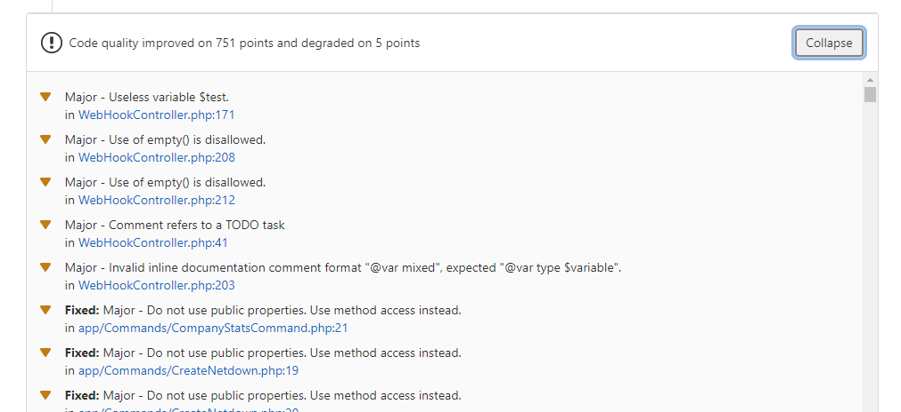

# Continuous Integration

You can run PHP Insights in your CI by defining a level you want to reach with the options `--min-quality`, `--min-complexity`, `--min-architecture`, `--min-style`.

If the minimum level defined is not reached, the console will return an exit error code.

```bash
./vendor/bin/phpinsights --no-interaction --min-quality=80 --min-complexity=90 --min-architecture=75 --min-style=95

# Within Laravel
php artisan insights --no-interaction --min-quality=80 --min-complexity=90 --min-architecture=75 --min-style=95
```

These options can also be found in the configuration file, so no arguments need to be passed when calling the command.
Command arguments have higher priority than configuration values.

**Note**: The `--no-interaction` option is mandatory when it's launched in CI to avoid prompts.

All others are optional, so if you want to focus only on style, add the `--min-style` and forget others.

## Disable Security Check

In case you develop a library or a plugin, it could be compatible with a large panel of dependency versions.
So you can launch your `composer update` with the `--prefer-lower` flag to test these minimum versions.

As `phpinsights` returns an exit error code if security issues are found, you can disable this check by adding the `--disable-security-check` option:

```bash
./vendor/bin/phpinsights --no-interaction --disable-security-check
```

**Note** : For a project inspection, you **should** never use this option to keep your project safe.

## Github Action <Badge text="^1.13"/>

If you use Github Action, you can launch PHP Insights with the `--format=github-action` option.
With that, annotations with issues will be added in the Pull request.


```yaml
#.github/workflows/pr.yml
name: CI
on:
    - pull_request

jobs:
    phpinsights:
        runs-on: ubuntu-latest
        name: PHP Insights checks
        steps:
            - uses: actions/checkout@v2
            - uses: shivammathur/setup-php@v2
              with:
                  php-version: 8.0
            - run: composer install --prefer-dist --no-progress --no-suggest
            - run: vendor/bin/phpinsights -n --ansi --format=github-action
```


## GitLab Code Quality <Badge text="^2.0"/>

If you use GitLab, you can launch PHP Insights with the `--format=codeclimate` option.
With that, annotations with issues will be added in a merge request with Code Quality.


```yaml
#.gitlab-ci.yml
insights:
  script:
    - vendor/bin/phpinsights -n --ansi --format=codeclimate > codeclimate-report.json
  artifacts:
    reports:
      codequality: codeclimate-report.json
```


